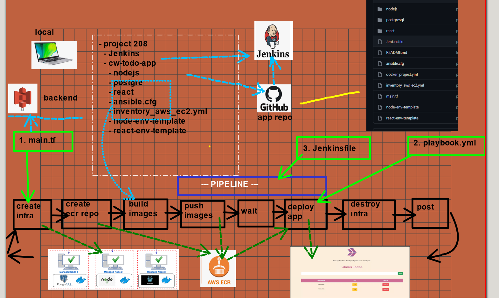

## SOLUTION STEPS



- Run Terraform file under jenkins_server directory

```
terraform init
terraform apply -auto-approve
````
- Connect to jenkins server. Go to ManageJenkins/ManagePlugins/AvailablePlugins. Install "terraform" & "ansible" plugins.

- Go to ManageJenkins/Global Tool Configuration/ . Add Terrafrom & Ansible Path.

- Go to ManageJenkins/Credentials/ . Create github token credentials & .pem key credentials.

- Go to  AWS S3 Service. Create a bucket with the same name as the S3 Bucket you specified in main.tf

- Go to AWS System Manager/Parameter Store/ . Create two parameters named "db_name" and "db_password" .

- What to check in all files: AwsUserID, .pem key name, file names, image names, repo names, Paths etc.

- Push all files to Githup repository. Create webhooks in Github repo.

- Creat New Pipeline in Jenkins. Select Github repo, select github trigger, select Pipeline script from SCM

- Run the Job.
    


